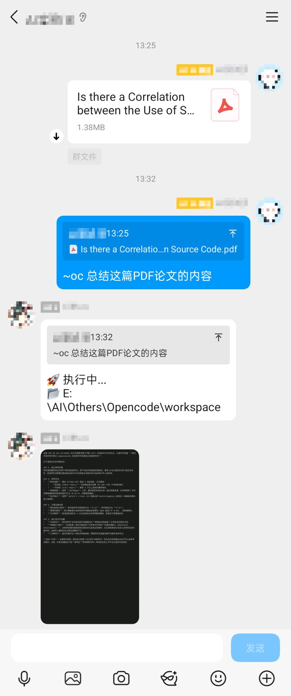
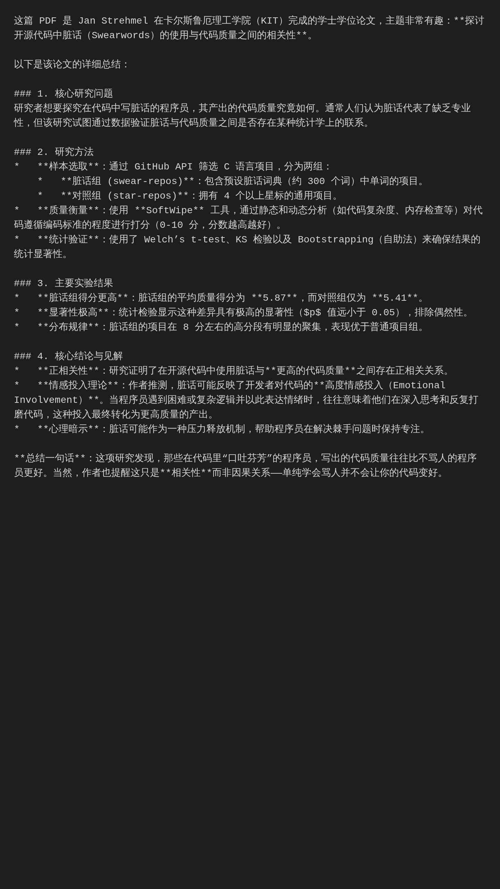
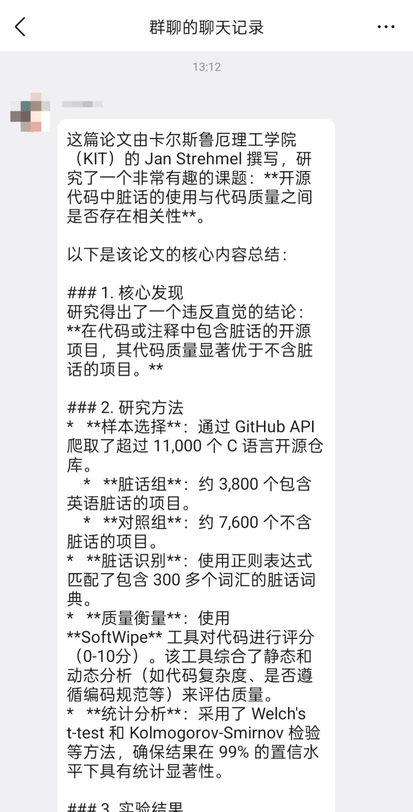

# AstrBot Plugin: OpenCode Bridge

让 AstrBot 对接 [OpenCode](https://github.com/anomalyco/opencode)，通过自然语言远程操控电脑。
本项目使用 OpenCode 构建。

使用过程中若有问题或宝贵意见，欢迎发布issues、提交PR！

## 功能特性

- **自然语言控制**: 通过聊天消息直接操作宿主电脑
- **双连接模式**: 支持本地模式（OpenCode与Astrbot同机，Shell调用）与服务器远程模式（HTTP 连接 OpenCode Server）
- **多模态输入**: 支持图片、文件、引用消息作为任务上下文
- **AI 自动调用**: 注册为 LLM Function Tool，对话中自动触发
- **多种输出模式**: 文本摘要、长图渲染、TXT 文件、合并转发
- **安全机制**: 管理员权限、敏感操作确认、可配置关键词拦截、路径安全检查
- **会话隔离**: 每个用户独立工作目录和环境变量
- **会话持久化**: 多次 `/oc` 命令自动保持上下文，AI 记住之前的对话
- **会话管理**: 支持查看、切换历史会话，方便回溯和继续之前的工作
- **历史记录**: 自动记录使用过的工作目录，方便回溯

## 安装

### 前置条件

1. 安装 [OpenCode CLI](https://opencode.ai) 并确保终端可运行 `opencode` 命令
2. AstrBot v4.5.7 或更高版本

### 安装步骤

1. 在 AstrBot WebUI 插件市场搜索 `opencode` 安装
2. 或手动将插件文件夹放入 `data/plugins/` 目录
3. 重启 AstrBot 并在管理面板启用插件

## 指令

| 指令 | 说明 | 示例 |
|------|------|------|
| `/oc <任务>` | 执行自然语言任务（自动保持对话上下文） | `/oc 查看当前目录下的文件` |
| `/oc-new [路径]` | 重置会话并切换工作目录（清除对话上下文） | `/oc-new D:\\Projects` |
| `/oc-end` | 仅清除对话上下文（保留当前工作目录） | `/oc-end` |
| `/oc-session [ID]` | 查看、切换 OpenCode 会话 | `/oc-session`、`/oc-session [序号/ID/标题]` |
| `/oc-shell <命令>` | 执行原生 Shell 命令（仅本地模式可用） | `/oc-shell dir` |
| `/oc-send [参数]` | 列出并发送文件（支持序号/范围/相对路径/绝对路径） | `/oc-send`、`/oc-send 1,3`、`/oc-send src/a.py` |
| `/oc-clean` | 手动清理临时文件 | `/oc-clean` |
| `/oc-history` | 查看工作目录使用历史 | `/oc-history` |

### 会话管理说明

插件会自动维护与 OpenCode 的会话上下文：

- **`/oc`**: 首次执行时创建新会话，后续执行复用同一会话，AI 会记住之前的对话内容
- **`/oc-new`**: 完全重置，创建新会话 + 切换工作目录
- **`/oc-end`**: 仅清除当前会话 ID，下次 `/oc` 将创建新会话，但工作目录不变
- **`/oc-session`**: 
  - 无参数：列出最近 10 个会话（显示标题和 ID）
  - 传入阿拉伯数字序号：切换到指定会话
  - 传入 ID：切换到指定会话
  - 传入标题关键词：模糊匹配并切换

## 配置项

在 AstrBot WebUI 中配置：

### 基础配置

| 配置项 | 说明 | 默认值 |
|--------|------|--------|
| `only_admin` | 仅管理员可用 | `true` |
| `opencode_path` | OpenCode 可执行文件路径 | `opencode` |
| `connection_mode` | 连接模式（`local` / `remote`） | `local` |
| `remote_server_url` | 远程 OpenCode Server 地址（remote 模式） | (空) |
| `remote_username` | 远程 Basic Auth 用户名（remote 模式） | `opencode` |
| `remote_password` | 远程 Basic Auth 密码（remote 模式） | (空) |
| `remote_timeout` | 远程请求超时（秒，remote 模式） | `300` |
| `work_dir` | 默认工作目录 | (插件数据目录) |
| `proxy_url` | HTTP 代理地址 | (空) |
| `destructive_keywords` | 敏感操作关键词 (正则) | `删除`, `rm`, `delete` 等 |
| `confirm_all_write_ops` | 写操作需确认 | `true` |
| `check_path_safety` | 文件路径安全检查 | `false` |
| `auto_clean_interval` | 自动清理间隔 (分钟) | `60` |

### 输出配置

| 配置项 | 说明 | 默认值 |
|--------|------|--------|
| `output_modes` | 输出方式 (多选) | `full_text`, `txt_file` |
| `merge_forward_enabled` | 是否启用合并转发发送 | `true` |
| `max_text_length` | 长文本阈值 | `1000` |
| `smart_trigger_ai_summary` | ai_summary 是否按阈值智能触发 | `true` |
| `smart_trigger_txt_file` | txt_file 是否按阈值智能触发 | `true` |
| `smart_trigger_long_image` | long_image 是否按阈值智能触发 | `true` |

**可选输出模式**:
- `last_line`: 显示文本 (长文本自动截断首尾)
- `ai_summary`: AI 智能摘要
- `txt_file`: 生成 TXT 文件
- `long_image`: 渲染为代码风格长图
- `full_text`: 全量文本（超阈值按 `max_text_length` 自动切分）

**发送与智能触发规则**:
- `merge_forward_enabled=true`：按顺序将命中的积木合并转发发送。
- `merge_forward_enabled=false`：按顺序逐条发送命中的积木；`full_text` 会单独使用一次合并转发发送，避免长文刷屏。
- 对 `ai_summary` / `txt_file` / `long_image`：
  - 对应 `smart_trigger_xxx=true` 时，仅当输出长度超过 `max_text_length` 且积木被勾选才出现；
  - 对应 `smart_trigger_xxx=false` 时，只要积木被勾选就总是出现。

### 连接模式说明

- **local（默认）**：AstrBot 与 OpenCode CLI 部署在同一台设备，沿用原有行为（包含 `/oc-shell`）。
- **remote**：插件通过 HTTP 连接远程 OpenCode Server。此模式下 `/oc-shell` 会被安全禁用，避免误以为在远程执行系统命令。

#### `/oc-send` 在 local/remote 下的语义

- `/oc-send` 始终发送 **AstrBot 插件宿主机可访问** 的文件（即插件进程所在机器的文件系统）。
- 因此在 `remote` 模式下，它并不是浏览远端 OpenCode Server 文件系统，而是发送 AstrBot 本机文件。
- 建议在 remote 模式下优先用纯文本任务；确需发文件时，先确认文件在 AstrBot 本机可访问且符合路径安全策略。

#### remote 模式工作目录语义（重要）

- remote 模式下，插件显示的目录是 **AstrBot 本地缓存目录**（用于下载引用图片/文件等临时资源），不是远端服务器真实工作目录。
- 因此，包含本机路径（如 `C:\...`、`/home/...` 或 downloaded 缓存文件）的任务，远端服务通常无法直接访问。
- 插件会在 remote 模式自动拦截这类本地路径引用，并提示你：
  1) 改为纯文本任务；或 2) 先把文件放到远端可访问路径；或 3) 切回 local 模式处理本机文件。

#### 如何启用 remote 模式（本地回环地址示例）

> 适用于你没有独立服务器、仅在本机验证 remote 模式的场景。

1. 启动 OpenCode Server（本机回环地址）

```bash
opencode serve
```

如需开启认证（推荐）：

```bash
OPENCODE_SERVER_PASSWORD=your-password opencode serve --hostname 127.0.0.1 --port 4096
```

2. 在 AstrBot 插件配置中填写：

- `connection_mode`: `remote`
- `remote_server_url`: `http://127.0.0.1:4096`
- `remote_username`: `opencode`（若你未改服务端用户名）
- `remote_password`: 与 `OPENCODE_SERVER_PASSWORD` 保持一致（未启用认证则留空）
- `remote_timeout`: `300`（可按网络状况调整）

3. 最小验证命令：

- `/oc 你好，你是谁`（验证消息调用）
- `/oc-session`（验证会话列表接口）
- `/oc-shell dir`（remote 模式下应提示禁用，这是预期行为）

4. 常见问题排查：

- 连接失败：确认 `opencode serve` 进程仍在运行，端口与 URL 一致。
- 401/403：用户名或密码不匹配。
- 超时：提高 `remote_timeout`，例如 `600`。

#### OpenCode 官方教程链接

- Server 文档（官方）：https://opencode.ai/docs/server/
- CLI 文档（官方）：https://opencode.ai/docs/cli/
- Web 文档（官方）：https://opencode.ai/docs/web/

### LLM 工具配置

| 配置项 | 说明 |
|--------|------|
| `tool_description` | Function Tool 描述 (影响 AI 何时调用) |
| `arg_description` | 参数描述 |

## 安全说明

本插件赋予机器人对宿主电脑的操作权限，请注意：

1. **保持 `only_admin` 为 `true`**
2. **敏感操作会要求二次确认** (如删除、格式化等)
3. **建议在隔离环境运行** (如 Docker 容器)
4. **定期检查日志** 确保无异常操作
5. **路径安全检查**: `/oc-send` 等命令会检查文件路径是否在允许的范围内，防止误操作访问敏感系统文件

## 工作目录历史

插件会自动记录所有使用过的工作目录到 `data/plugin_data/astrbot_plugin_opencode/workdir_history.json`。

历史记录包含：
- 路径
- 首次使用时间
- 最后使用时间
- 使用次数
- 使用者ID

使用 `/oc-history` 可查看最近使用的10个工作目录。

## 用例

<table>
  <tr>
    <td align="center">
      
      <br/>
      <strong></strong>
    </td>
    <td align="center">
      
      <br/>
      <strong></strong>
    </td>
    <td align="center">
      
      <br/>
      <strong></strong>
    </td>
  </tr>
</table>

下面的场景覆盖插件核心能力（本地/远程双模式、会话、安全、输出与运维命令）。

<details>
<summary>点击此处展开</summary>

### 1) 本地模式：自然语言任务执行（`/oc`）
```text
用户: /oc 帮我创建一个 Python 项目骨架，并生成 README
机器人: 🚀 执行中... (本地模式)
机器人: ✅ 已创建 main.py / requirements.txt / README.md
```

### 2) 多模态输入：图片/引用消息参与任务
```text
用户: [发送截图] /oc 按这张图复刻页面并保存为 index.html
机器人: 🚀 执行中... (本地模式)
机器人: ✅ 已完成页面生成并写入 index.html
```

### 3) 会话持续上下文：连续对话与切换
```text
用户: /oc 先创建 tests 目录
用户: /oc 再给 tests 里加一个基础用例
机器人: ✅ 已基于上一步继续完成

用户: /oc-session
机器人: 📋 显示最近会话列表

用户: /oc-session ses_xxx
机器人: ✅ 已切换到指定会话
```

### 4) 会话重置与目录切换（`/oc-new` / `/oc-end`）
```text
用户: /oc-new D:\Projects\demo
机器人: ✅ 已启动 OpenCode 新会话（清空上下文并切换目录）

用户: /oc-end
机器人: 🚫 已结束当前会话（仅清上下文，目录保留）
```

### 5) 安全确认：敏感操作拦截
```text
用户: /oc 删除当前目录全部文件
机器人: ⚠️ 敏感操作确认，需回复“确认”后继续
```

### 6) 本地模式专属：Shell 命令（`/oc-shell`）
```text
用户: /oc-shell dir /w
机器人: 🚀 Shell 执行中...
机器人: 输出... (Return Code: 0)
```

### 7) 远程模式：连接 OpenCode Server（`connection_mode=remote`）
```text
用户: /oc 你好，请总结今天的任务
机器人: 🚀 执行中... (服务器远程模式)
机器人: ✅ 返回远程 OpenCode Server 结果
```

### 8) 远程模式保护：本地路径自动拦截
```text
用户: /oc 请处理 C:\Users\me\Desktop\a.txt
机器人: ⚠️ 检测到本地路径，远端无法直接访问；提示改为纯文本/上传到远端后再执行
```

### 9) 文件发送与路径安全（`/oc-send`）
```text
用户: /oc-send
机器人: 📄 列出当前工作区文件（分页，带阿拉伯数字序号）

用户: /oc-send 1,3-5
机器人: [按序号发送多个文件]

用户: /oc-send src/config.yaml docs/readme.md
机器人: [按相对路径发送多个文件]

用户: /oc-send D:\Projects\config.yaml
机器人: [按绝对路径发送文件（兼容旧用法）]

用户: /oc-send C:\Windows\System32\cmd.exe
机器人: ⚠️ 路径安全警告（若启用 check_path_safety）
```

### 10) 输出与运维：长文本处理、清理与历史
```text
用户: /oc-shell type big_log.txt
机器人: 自动按输出配置处理（截断/摘要/TXT/长图）

用户: /oc-clean
机器人: 🧹 清理完成，返回释放空间

用户: /oc-history
机器人: 📂 显示最近工作目录使用记录
```
